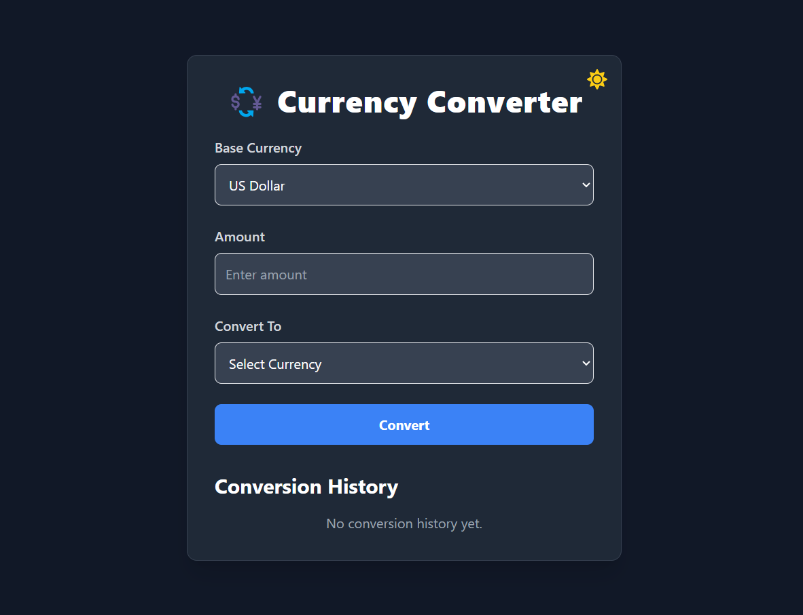
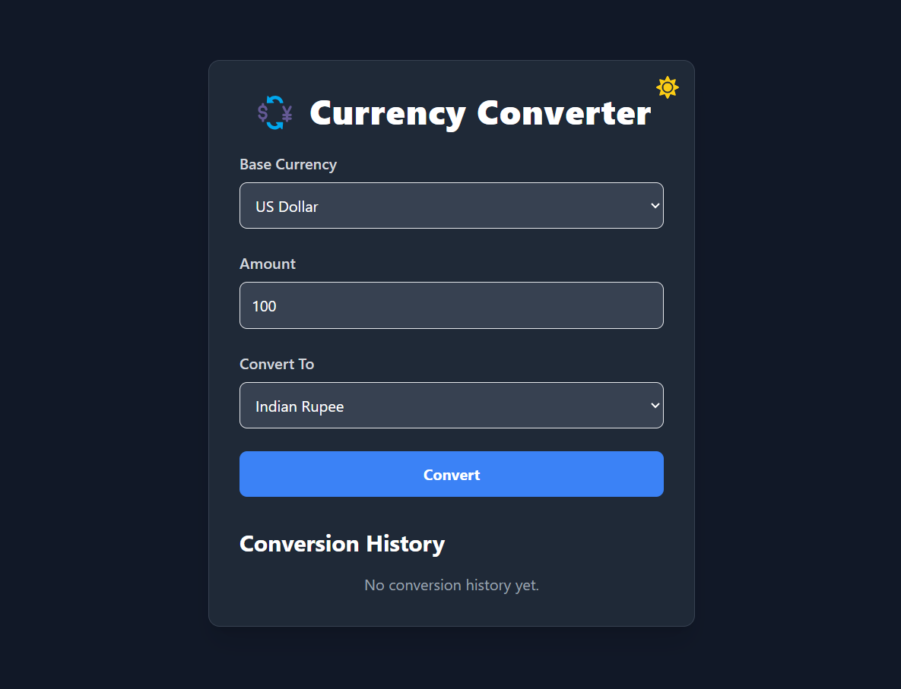
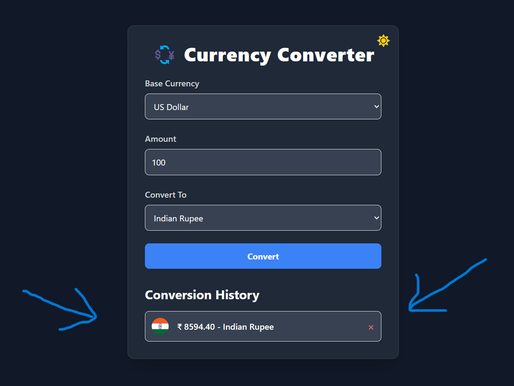

# 💱 Currency Converter App

A modern and responsive currency converter web application built with **React**, **Node.js**, and **FreeCurrencyAPI**. It supports **light/dark mode**, real-time conversion, and keeps a **local history** of your previous conversions.

---

## 🚀 Features

- 🌐 Convert between 30+ currencies
- 🌓 Toggle between Light & Dark themes
- 💾 Stores your conversion history locally
- 📈 Real-time exchange rates using FreeCurrencyAPI
- 🇺🇳 Displays country flags and currency symbols
- ❌ Delete specific history entries
- ⚡ Fast, responsive, and easy-to-use interface

---

## 🖼️ Screenshots

### 🌗 Light Mode & Dark Mode

| Light Mode | Dark Mode |
|------------|-----------|
|  |  |

The application offers a seamless **theme toggle** experience:
- ☀️ Light Mode provides a clean, bright interface.
- 🌙 Dark Mode is ideal for low-light environments and is easy on the eyes.
- Toggle between modes using the sun/moon icon at the top-right.

---

### 📖 Conversion History

| Convert Currency | Conversion History |
|------------------|--------------------|
|  |  |

The app maintains a local **conversion history** for every currency conversion:
- Displays converted **amount**, **currency symbol** and **country name**.
- Stored in **`localStorage`**, so history persists even after refreshing the page.
- You can ❌ **delete individual entries** to keep your history clean and relevant.

---

## 🛠️ Tech Stack

- **Frontend**: React.js, Tailwind CSS, React Icons
- **Backend**: Node.js, Express.js, dotenv, axios
- **API**: [FreeCurrencyAPI](https://freecurrencyapi.com/)
