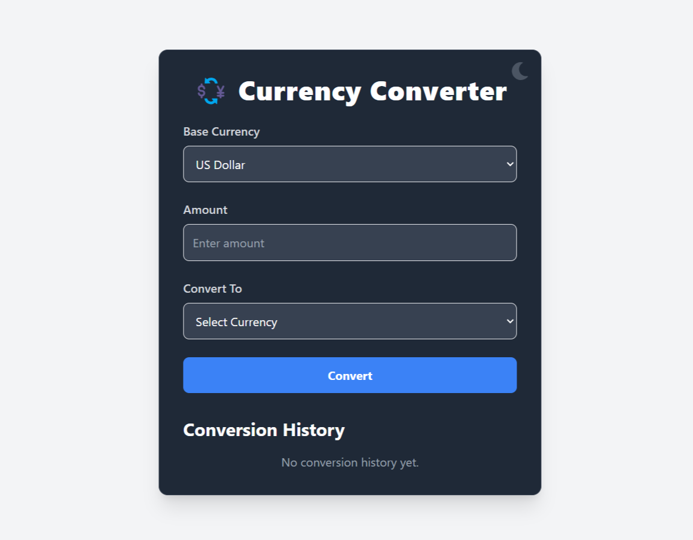

# 💱 Currency Converter App

A modern and responsive currency converter web application built with **React**, **Node.js**, and **FreeCurrencyAPI**. It supports **light/dark mode**, real-time conversion, and keeps a **local history** of your previous conversions.

---

## 🚀 Features

- 🌐 Convert between 30+ currencies
- 🌓 Toggle between Light & Dark themes
- 💾 Stores your conversion history locally
- 📈 Real-time exchange rates using FreeCurrencyAPI
- 🇺🇳 Displays country flags and currency symbols
- ❌ Delete specific history entries
- ⚡ Fast, responsive, and easy-to-use interface

---

## 🖼️ Screenshots

### 🌗 Light Mode & Dark Mode

| Light Mode | Dark Mode |
|------------|-----------|
|  |  |

- Toggle themes using ☀️ / 🌙 button on the top right
- Built with Tailwind CSS `dark:` classes

---

### 📖 Conversion History

| Convert Currency | Conversion History |
|------------------|--------------------|
|  |  |

- Automatically logs each conversion
- Stores amount, currency, date & time, and flag
- Uses `localStorage` so data persists after refresh

---

## 🛠️ Tech Stack

- **Frontend**: React.js, Tailwind CSS, React Icons
- **Backend**: Node.js, Express.js, dotenv, axios
- **API**: [FreeCurrencyAPI](https://freecurrencyapi.com/)

---

## 📦 Installation & Usage

### 1. Clone the repo

```bash
git clone https://github.com/your-username/currency-converter.git
cd currency-converter
